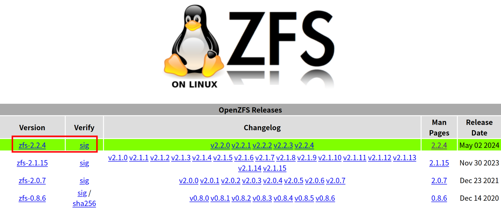

# How to build the ZFS kernel module against a Ubuntu mainline kernel

Documents the process of building a recent version ZFS kernel module against a Ubuntu mainline kernel version, and the details on how to make it work properly in runtime.

<https://gitlab.com/brlin/ubuntu-mainline-kernel-with-zfs-howto>  
[](https://gitlab.com/brlin/ubuntu-mainline-kernel-with-zfs-howto/-/pipelines) [](https://github.com/brlin-tw/ubuntu-mainline-kernel-with-zfs-howto/actions/workflows/check-potential-problems.yml) [](https://pre-commit.com/) [](https://api.reuse.software/info/gitlab.com/brlin/ubuntu-mainline-kernel-with-zfs-howto)

## The problem

The AMDGPU driver shipped in the Ubuntu 24.04 kernel contains a issue that may cause system instability after some videos are played on a Framework Laptop 13(AMD 7040 series) system.  I would like to install a recent [mainline kernel](https://kernel.ubuntu.com/mainline/) built by Ubuntu to check whether the issue can still be reproduced, however it failed to boot due to the missing ZFS driver which is used as the storage system in my system.  Installing the `zfs-dkms` package doesn't work either as it isn't compatible with newer kernel versions.

## The solution

I would like to build the recent version ZFS kernel against the mainline kernel version to allow the system to boot without rebuilding the entire Linux kernel.

## Acquire the project release archive

This project provides a working directory with auxiliary files(referenced later as "the project working directory") to help you work with the tutorial.  Download the ubuntu-mainline-kernel-with-zfs-howto-_X_._Y_._Z_.tar.gz release package from [the Releases page](https://gitlab.com/brlin/ubuntu-mainline-kernel-with-zfs-howto/-/releases).

## Launch a text terminal

The following operations are necessary or recommended to be done in a text terminal application, launch the one of your preference.

## Extract the project working directory

Run the following command in the aforementioned terminal application to change the terminal working directory to the directory you wish to host the project working directory:

```bash
cd /path/to/workdir/hosting/dir
```

Then run the following command to extract the working directory:

```bash
tar_opts=(
    --extract
    --file /path/to/ubuntu-mainline-kernel-with-zfs-howto-_X_._Y_._Z_.tar.gz
)
if ! tar "${tar_opts[@]}"; then
    printf 'Extract failed.\n' 1>&2
fi
```

## Change the terminal working directory to the project working directory

You may run the following command to switch the terminal working directory to the project working directory:

```bash
if ! cd ubuntu-mainline-kernel-with-zfs-howto-_X_._Y_._Z_; then
    printf 'Working directory switch failed.\n' 1>&2
fi
```

## Install a mainline kernel

Download the desired kernel package from the [Ubuntu Mainline Kernel PPA Archive Ubuntu https://kernel.ubuntu.com › ~kernel-ppa](https://kernel.ubuntu.com/~kernel-ppa/mainline/) and install it using the following terminal command as root:

```bash
sudo apt install /path/to/linux-*.deb
```

**WARNING:** Be careful not to accidentally install unrelated kernel packages.  You may check how the `/path/to/linux-*.deb` glob pattern expanded by running the following command in the terminal:

```bash
echo /path/to/linux-*.deb
```

You can also use [the Mainline Kernels utility](https://github.com/bkw777/mainline) to install and manage Ubuntu mainline kernels.

This kernel will currently not be able to boot the system as it does not have the required driver to mount the root filesystem on the ZFS storage system.

## Acquire a recent OpenZFS on Linux source archive

You may acquire the source archive and the PGP signature required to verify the archive on the [OpenZFS on Linux](https://zfsonlinux.org/) website:



## Verify the authenticity of the OpenZFS source archive

We can verify the authenticity of the OpenZFS source archive via the [Pretty Good Privacy(PGP)](https://en.wikipedia.org/wiki/Pretty_Good_Privacy) public key of the software publisher as well as the PGP signature files distributed along with the source archives.

Run the following command to query the PGP public key that is used for the verification of the ZFS source archive:

```bash
zfs_version=2.2.4
gpg_opts=(
    --verify "zfs-${zfs_version}.tar.gz.asc" "zfs-${zfs_version}.tar.gz"
)
if ! gpg "${gpg_opts[@]}"; then
    printf \
        'Error: Unable to verify the authenticity of the ZFS source archive.\n' \
        1>&2
fi
```

, it should have the following similar output:

```output
gpg: Signature made Fri May  3 05:51:02 2024 CST
gpg:                using RSA key 6AD860EED4598027
gpg: Can't check signature: No public key
Error: Unable to verify the authenticity of the ZFS source archive.
```

We can retrieve and import the PGP public key by running the following commands:

```bash
gpg_opts=(
    --keyserver hkps://keyserver.ubuntu.com
    --receive-keys 6AD860EED4598027
)
if ! gpg "${gpg_opts[@]}"; then
    printf \
        'Error: Unable to import the PGP public key from the keyserver.\n' \
        1>&2
fi
```

It should have the following output:

```output
gpg: key 6AD860EED4598027: public key "Tony Hutter (GPG key for signing ZFS releases) <hutter2@llnl.gov>" imported
gpg: Total number processed: 1
gpg:               imported: 1
```

We can re-run the `gpg --verify` command to verify the authenticity of the OpenZFS source archive:

```bash
zfs_version=2.2.4
gpg_opts=(
    --verify "zfs-${zfs_version}.tar.gz.asc" "zfs-${zfs_version}.tar.gz"
)
if ! gpg "${gpg_opts[@]}"; then
    printf \
        'Error: Unable to verify the authenticity of the ZFS source archive.\n' \
        1>&2
fi
```

It should have the following similar output:

```output
gpg: Signature made Fri May  3 05:51:02 2024 CST
gpg:                using RSA key 6AD860EED4598027
gpg: Good signature from "Tony Hutter (GPG key for signing ZFS releases) <hutter2@llnl.gov>" [unknown]
gpg: WARNING: This key is not certified with a trusted signature!
gpg:          There is no indication that the signature belongs to the owner.
Primary key fingerprint: 4F3B A9AB 6D1F 8D68 3DC2  DFB5 6AD8 60EE D459 8027
```

The `WARNING: This key is not certified with a trusted signature!` warning message indicates that the PGP web of trust trust chain cannot be created from your PGP keypairs(if available), which is an expected outcome for one without a complete web of trust infrastructure.  How to eliminate such problem is outside of the scope of this article.

## Extract the OpenZFS source archive

Run the following command to extract the OpenZFS source archive:

```bash
zfs_version=2.2.4
tar_opts=(
    --extract
    --file "zfs-${zfs_version}.tar.gz"
)
if ! tar "${tar_opts[@]}"; then
    printf 'The archive extraction has failed.\n' 1>&2
fi
```

## Licensing

Unless otherwise noted(individual file's header/[REUSE DEP5](.reuse/dep5)), this product is licensed under [the 4.0 International version of the Creative Commons Attribution-ShareAlike license](https://creativecommons.org/licenses/by-sa/4.0/), or any of its more recent versions of your preference.

This work complies to [the REUSE Specification](https://reuse.software/spec/), refer the [REUSE - Make licensing easy for everyone](https://reuse.software/) website for info regarding the licensing of this product.
